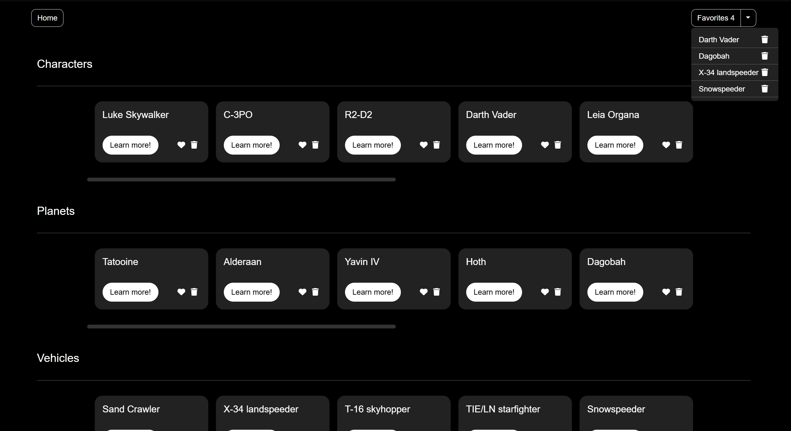

# Star Wars blog reading list

[](https://react.dev/)
[](https://developer.mozilla.org/en-US/docs/Web/JavaScript)
[](https://developer.mozilla.org/en-US/docs/Web/CSS)
[](https://swapi.dev/)

<br>

> **⚠️ Note:** This is a legacy learning project built during my first months of web development as part of the **4Geeks Academy** Full Stack Developer bootcamp. I keep it here as a reference of my technical evolution and my beginnings with API consumption and state management.

<br>

Interactive dashboard that consumes the Star Wars API (SWAPI) to display information about characters, planets, and vehicles, including a favorites management system.

<br>

## Preview



<br>

## Technologies

- React.js 18.2
- JavaScript (ES6+)
- Vanilla CSS
- Context API & useReducer
- SWAPI (Star Wars API)

<br>

## Installation

1. Clone the repository:
   ```bash
   git clone https://github.com/Antonio-Borrero/starwars-blog-reading-list.git
   ```
   
2. Install dependencies:
   ```bash
   npm install
   ```

3. Run the app in development mode:
   ```bash
   npm run start
   ```

4. Open [http://localhost:3000](http://localhost:3000) on the browser:

   - The app will automatically reload when any file is modified

<br>

## Features

- **Multi-Category Explorer:** Dynamic fetching and display of Characters, Planets, and Vehicles.
- **Global Favorites Management:** Add and remove items from a favorites list that is accessible from any part of the app.
- **Real-time Favorites Counter:** A dynamic counter in the navigation bar that updates instantly.
- **Detailed Views:** Specific dynamic routes to explore extended information for each Star Wars entity.
- **CRUD Operations:** Functional logic to handle data interaction (Like/Delete/View) via global state.

<br>

## Learning Outcomes

- **State Management Architecture:** Learned how to implement a scalable "Store" pattern using `useContext` and `useReducer` to manage global state.
- **Asynchronous Data Handling:** Gained experience managing complex API responses, handling loading states, and mapping data to dynamic components.
- **Declarative UI & Routing:** Mastered React's declarative nature to sync the UI with the state and implemented dynamic routing for a seamless SPA (Single Page Application) experience.
